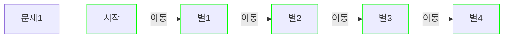
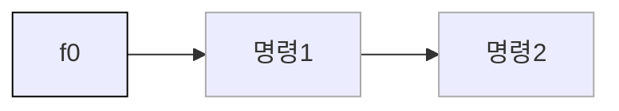

합격선이 많이 높지는 않지만, 아예 처음이라 감을 못잡는 분들, 고득점을 노리시는 분들 위해 논리 테스트를 보며 느꼈던 점을 남겨 둡니다.

### 논리 테스트 기본 

이노베이션 아카데미에서 보게되는 논리테스트는 나의 <b>말을 움직여서 모든 별을 획득하는 퍼즐</b>입니다. 
아래와 같이 말을 계속 움직여서 별에 있는 모든 칸에 도달하면 클리어할 수 있습니다. 

위의 문제1의 경우는 4번 이동하기만 하면 되는 쉬운 문제지만, 저희가 할 수 있는 행동은 보통 그만큼 주지 않습니다. 
저희가 명령할 수 있는 행동의 뭉치를 <b>함수</b>라고 지칭하며 이 테스트에서 각각의 함수는 f0, f1, f2 ... 으로 표현됩니다. 
그리고 이 함수는 미리 정해진 횟수 만큼의 명령만 수행 가능합니다. 
첫번째 함수는 f0으로 표현되고 이 함수가 명령을 2개 담을 수 있다면 아래와 같이 표현할 수 있습니다. 

그리고 저희는 이 f0을 통하여 문제 1을 풀어야 합니다. 

### 고득점을 위한 개념

대략 15단계 즈음을 가면 일반적인 함수의 반복으로는 풀 수 없는 복잡한 문제가 나오기 시작합니다. 
아카데미에 입학하게 되면 배우게 되겠지만 <i>스택</i>이라는 개념으로 비전공자이시면 지금은 용어까지 외울 필요는 없습니다. 
다만 그 개념은 알고 있어야 높은 단계의 문제를 풀 수 있습니다.  

 